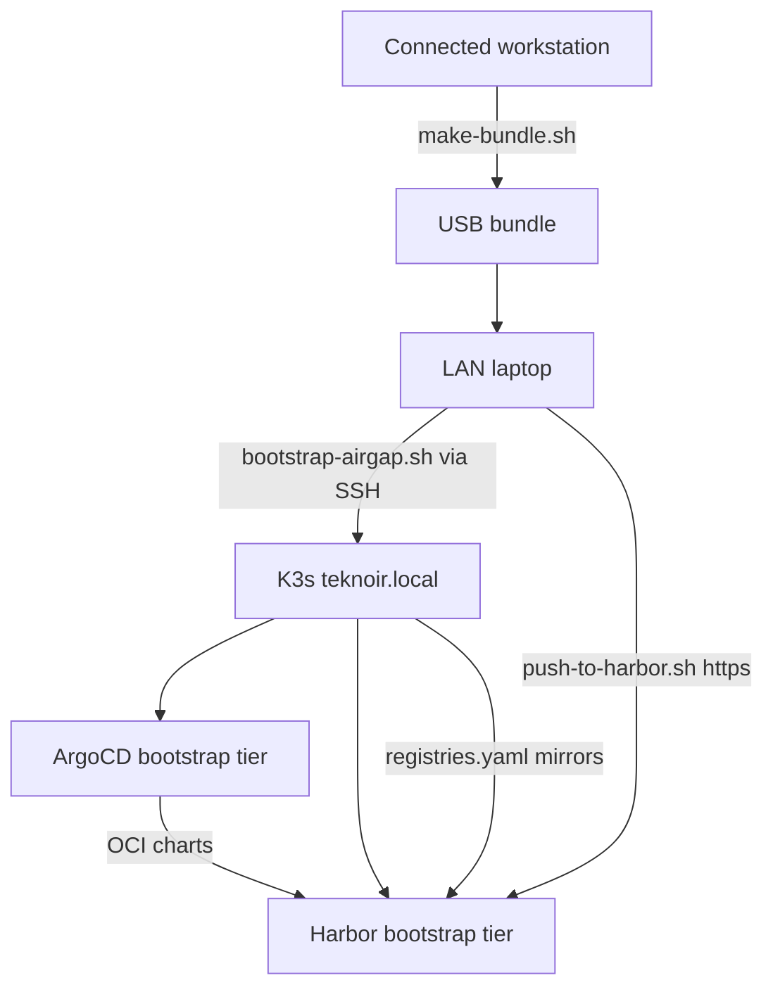

# Requirements

### Overview & Goals
Make the `teknoir-local` branch of the infra repo bootstrap an **air-gapped** K3s cluster at `teknoir@teknoir.local`, with the platform served at `https://teknoir.local`. All Helm charts and container images are delivered via a portable bundle (USB) and served from **in-cluster Harbor**; ArgoCD consumes GitOps content as **Helm OCI charts** from Harbor.

### Scope
**In scope**
- Infra repo: bootstrap of ArgoCD + Harbor + base secrets on existing K3s; removal of internet-dependent scripts/secrets; air-gap bundle build/install/update scripts; runbook documentation.
- GitOps repo (`/Volumes/GIT/ai/platform-applications-gitops`, branch `teknoir-local`): convert Applications to Harbor OCI sources, `teknoir.local` domain, CA-based cert-manager issuer, add Harbor Application.

**Out of scope**
- K3s installation itself (cluster already exists at data-dir `/opt/k3s`).
- Backstage (GitHub/gcloud-dependent) — excluded from the air-gapped app set, documented as a limitation.

### Functional Requirements
- First-time bootstrap works fully offline: pre-loaded containerd image tarballs + K3s auto-deploy manifests bring up ArgoCD and Harbor; then charts/images are pushed to Harbor and app-of-apps syncs the rest.
- Update procedure: build (full or incremental) bundle on a connected machine → USB → push to Harbor from a LAN laptop → bump pinned app-of-apps chart version over SSH.
- All secrets internet-dependent (GitHub App, GHCR/GCR, DNS providers, Let's Encrypt) removed; local Root CA + Harbor OCI repo-creds added.

### Non-Functional Requirements
- Scripts idempotent, with dry-run modes, shellcheck-clean.
- Proper TLS everywhere via local Teknoir Root CA (no insecure flags).

# Technical Design

### Current Implementation
- `scripts/deploy-argo.sh` renders `charts/argo` (vendored `argo-cd-10.4.0.tgz`) and SSH-copies it to `/opt/k3s/server/manifests/`; `scripts/deploy-secrets.sh` pushes secret manifests the same way.
- `teknoir-cloud-app-of-apps.yaml` points ArgoCD at `github.com/teknoir/platform-applications-gitops` using GitHub App repo-creds.
- GitOps charts already vendor dependency `.tgz` files; Harbor chart uses hostPath persistence and Istio gateway exposure.

### Key Decisions (validated with user)
1. **GitOps source**: Helm OCI charts in Harbor (`harbor.teknoir.local/teknoir/<chart>:<version>`), pinned versions instead of git branches.
2. **Image supply**: Harbor mirror projects (`dockerhub`, `ghcr`, `gcr`, `quay`, `k8s`) + K3s `registries.yaml` rewrites — no chart image overrides.
3. **TLS**: local Teknoir Root CA; cert-manager CA `ClusterIssuer` for `*.teknoir.local`; CA trusted by containerd, ArgoCD repo-server, and laptops.
4. **Bootstrap chicken-and-egg**: ArgoCD + Harbor deployed as static K3s auto-deploy manifests, their images pre-loaded as containerd tarballs in `/opt/k3s/agent/images/`.

### Proposed Changes
**Remove (infra)**: DNS/GCR/GHCR/backstage secret scripts, internet-downloading bootstrap scripts, generated manifests for removed secrets, GitHub App PEM.
**Modify (infra)**: `charts/argo/values.yaml` → `teknoir.local` domains + OIDC issuer; `deploy-argo.sh`/`deploy-secrets.sh` → `TEKNOIR_HOST=teknoir@teknoir.local`, reduced secret set; app-of-apps manifest → Helm OCI source.
**Create (infra)**: `scripts/gen-local-ca-secret.sh`, `scripts/gen-argocd-harbor-repo-secret.sh`, `airgap/` tooling (collect-charts, collect-images via crane, render-bootstrap, make-bundle with `--diff`; bootstrap-airgap, push-to-harbor, deploy-app-of-apps, update-airgap), `docs/AIRGAP-BOOTSTRAP.md`, `docs/AIRGAP-UPDATE.md`.
**GitOps repo**: app-of-apps templates → OCI sources with `chartVersions` map; remove `backstage.yaml`; add `harbor.yaml`; cert-manager → CA issuer (drop godaddy-webhook); domain → `teknoir.local` everywhere.

### Architecture Diagram

### Risks
- Image list incompleteness → `images-extra.txt` + verify script.
- Harbor self-hosting deadlock → Harbor/ArgoCD images always as containerd tarballs.
- `harbor.teknoir.local` resolution → node `/etc/hosts` + CoreDNS custom import.
- Version drift → `update-airgap.sh` verifies Harbor artifacts before patching `targetRevision`.

# Testing

### Validation Approach
Offline-renderability and script correctness are validated locally; cluster execution is a documented manual runbook.

### Key Scenarios
- `helm template` of infra `charts/argo` and every gitops chart succeeds offline using only vendored dependencies; rendered output contains no `teknoir.cloud`, `github.com`, or upstream repo URLs.
- `airgap/make-bundle.sh` produces a bundle with complete `bundle-manifest.yaml` checksums; `--diff` on unchanged repos yields an empty delta.
- `bootstrap-airgap.sh --dry-run` prints exact SSH/file operations without executing.
- `kubectl apply --dry-run=client` passes for all generated secret manifests and `teknoir-local-app-of-apps.yaml`.

### Edge Cases
- Missing bundle files → scripts fail fast with clear errors.
- Re-running `push-to-harbor.sh` skips digests already in Harbor (idempotency).
- CA validity ≥ 10 years verified via openssl.

### Test Changes
- All new/modified shell scripts pass `shellcheck` and `bash -n`.
- Add `airgap/verify-offline.sh` grep-based render check.

# Delivery Steps

###   Step 1: Strip internet dependencies from infra bootstrap
The infra `teknoir-local` branch contains no internet-dependent scripts, secrets, or artifacts, and the argo chart targets teknoir.local.

- Delete DNS/GCR/GHCR/backstage secret scripts, `bootstrap_teknoir_master.sh`, `bootstrap_agent_worker.sh`, GitHub App PEM, and manifests for removed secrets.
- Update `charts/argo/values.yaml`: `domain: teknoir.local`, `argocd.teknoir.local`, OIDC issuer `https://auth.teknoir.local/auth/realms/master`.
- Parameterize `TEKNOIR_HOST` (default `teknoir@teknoir.local`) in `scripts/deploy-argo.sh`; rewrite `scripts/deploy-secrets.sh` with a reduced, list-driven secret set.
- Extend `.gitignore` for rendered outputs, generated `manifest-*.yaml`, and bundle output; remove stale build artifacts.
- Verify `helm template charts/argo` renders offline.

###   Step 2: Add local CA and Harbor OCI repo secrets
Bootstrap secrets exist for TLS and for ArgoCD to pull Helm OCI charts from Harbor.

- Create `scripts/gen-local-ca-secret.sh` (10y Root CA, cert-manager secret manifest, exported `teknoir-root-ca.crt`).
- Create `scripts/gen-argocd-harbor-repo-secret.sh` (repo-creds secret: `type: helm`, `enableOCI: "true"`, `url: harbor.teknoir.local/teknoir`).
- Wire both into `scripts/deploy-secrets.sh`.
- Rename `teknoir-cloud-app-of-apps.yaml` → `teknoir-local-app-of-apps.yaml` with Helm OCI source (`repoURL: harbor.teknoir.local/teknoir`, `chart: app-of-apps`, pinned `targetRevision`).

###   Step 3: Convert gitops repo to Harbor OCI sources
All Applications in `platform-applications-gitops` (branch `teknoir-local`) source Helm OCI charts from Harbor and use teknoir.local.

- Convert app-of-apps templates (istio, auth, cert-manager, monitoring, controllers) to `repoURL: {{ .Values.ociRepoURL }}` + `chart:` + `chartVersions` map; set `project: teknoir-local`.
- Remove `backstage.yaml`; add `harbor.yaml` Application adopting the bootstrap-deployed Harbor (takeOwnership/ServerSideApply).
- cert-manager: drop godaddy-webhook dependency, add CA `ClusterIssuer` referencing `teknoir-root-ca` and a `*.teknoir.local` gateway Certificate.
- Replace `teknoir.cloud` with `teknoir.local` in harbor/auth/istio/monitoring/controller values.
- Verify every chart renders offline with vendored deps only.

###   Step 4: Implement bundle build tooling (connected side)
`airgap/make-bundle.sh` produces a complete, checksummed, USB-transportable bundle.

- Add `airgap/versions.env` (bundle version, gitops path, chart/image lists) and `airgap/images-extra.txt`.
- Implement `airgap/collect-charts.sh` (helm dependency build + package → `bundle/charts/`).
- Implement `airgap/collect-images.sh` (helm template extraction + crane OCI-layout pulls, digest dedup; bootstrap-tier containerd tarballs).
- Implement `airgap/render-bootstrap.sh` (argo + harbor static manifests, `registries.yaml` with mirror rewrites, `coredns-custom.yaml`, CA cert).
- Implement `airgap/make-bundle.sh` with `bundle-manifest.yaml` checksums and `--diff` incremental mode.

###   Step 5: Implement air-gapped install and update tooling
First-time bootstrap and updates run scripted from a LAN laptop against `teknoir@teknoir.local`.

- Implement `airgap/bootstrap-airgap.sh`: install CA + `registries.yaml`, hosts entries, copy image tarballs to `/opt/k3s/agent/images/`, restart k3s, deploy secrets + bootstrap manifests, wait for health; `--update` and `--dry-run` modes.
- Implement `airgap/push-to-harbor.sh`: create Harbor projects via API, `helm push` charts, `crane cp` images; idempotent, CA-trusted TLS.
- Implement `airgap/deploy-app-of-apps.sh` and `airgap/update-airgap.sh` (verify artifacts in Harbor, then patch app-of-apps `targetRevision` over SSH).
- All scripts pass shellcheck; add `airgap/verify-offline.sh` render check.

###   Step 6: Write air-gap runbooks and update READMEs
Complete documented procedures exist for first-time bootstrap and ongoing updates.

- Write `docs/AIRGAP-BOOTSTRAP.md`: prerequisites, bundle creation, transport, bootstrap steps, Keycloak manual setup, CA distribution, verification checklist, chicken-and-egg rationale.
- Write `docs/AIRGAP-UPDATE.md`: chart-version bump rules, full vs incremental bundles, Harbor push, app-of-apps bump, bootstrap-tier self-update, rollback via re-pinning.
- Rewrite `README.md` and `README_infra.md` for the air-gapped flow with `teknoir.local` URLs, linking both runbooks.